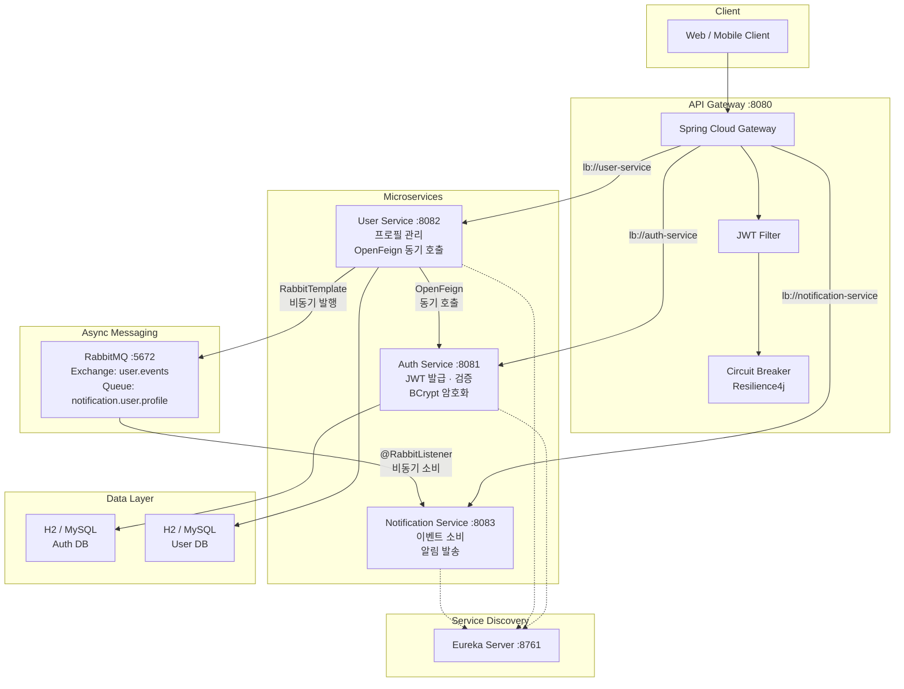
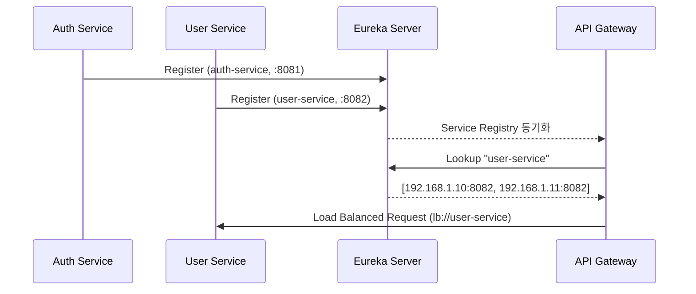
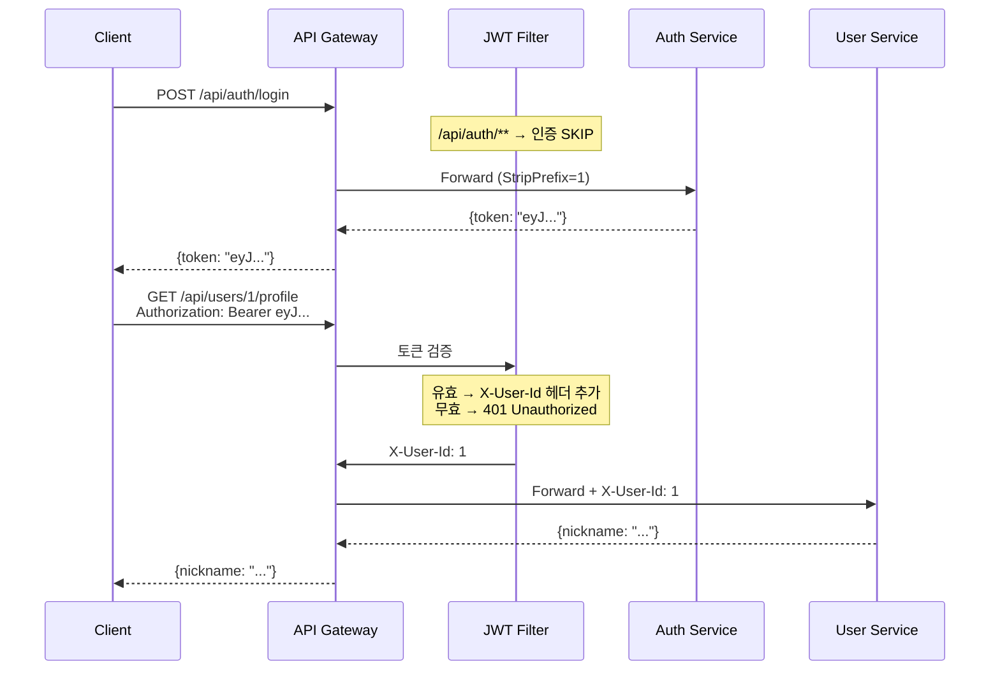
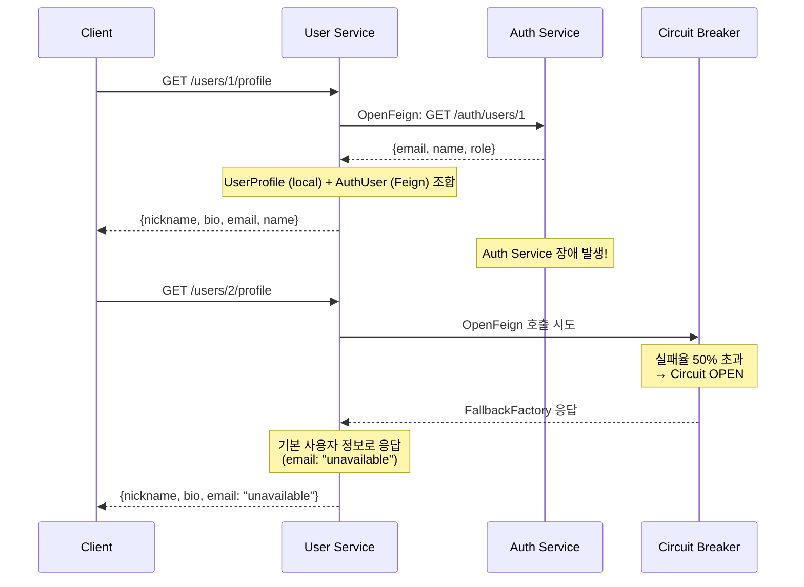
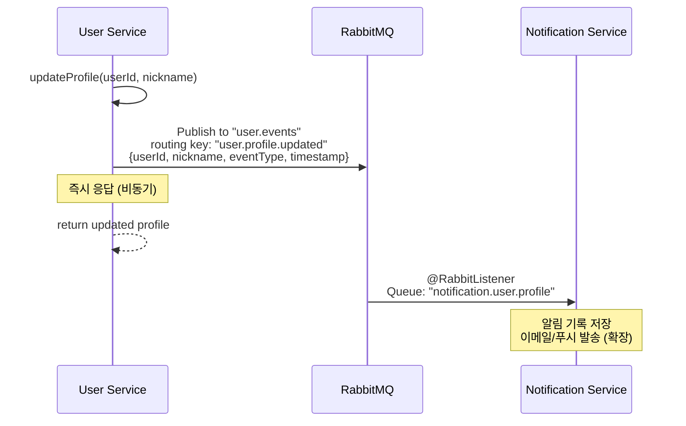

# Spring Cloud MSA Platform


Spring Cloud 기반 **마이크로서비스 아키텍처 플랫폼**입니다.
서비스 디스커버리, API Gateway, 동기/비동기 통신, Circuit Breaker 등 MSA 핵심 패턴을 구현합니다.

## Why MSA?

| 모놀리식 문제 | MSA 해결 |
|-------------|---------|
| 하나의 서비스 장애 → 전체 다운 | **Circuit Breaker** — 장애 격리, fallback 응답 |
| 서비스 주소 하드코딩 | **Eureka** — 동적 서비스 디스커버리 |
| 인증 로직 분산 | **API Gateway** — 단일 인증 게이트 |
| 동기 호출 병목 | **RabbitMQ** — 비동기 이벤트 처리 |
| 배포 단위가 큼 | **모듈별 독립 배포** — 영향 범위 최소화 |

## Architecture



## 핵심 패턴

### 1. Service Discovery (Eureka)



- 서비스가 시작되면 Eureka에 자동 등록
- Gateway는 서비스 이름(논리명)으로 라우팅 → IP/포트 하드코딩 불필요
- 인스턴스를 추가하면 자동으로 로드밸런싱 대상에 포함

### 2. API Gateway + JWT 인증



**설계 포인트:**
- 인증은 Gateway에서 1회만 수행 → 각 서비스는 `X-User-Id` 헤더만 신뢰
- `/api/auth/**`, `/actuator/**` 경로는 인증 제외
- 토큰 검증 실패 시 Gateway에서 즉시 401 반환 (서비스까지 도달하지 않음)

### 3. 동기 통신 (OpenFeign) + Circuit Breaker



```java
// OpenFeign 클라이언트 + Fallback
@FeignClient(name = "auth-service", fallbackFactory = AuthServiceClientFallback.class)
public interface AuthServiceClient {
    @GetMapping("/auth/users/{userId}")
    AuthUserResponse getUserById(@PathVariable("userId") Long userId);
}

// 장애 시 기본값 반환 (서비스 전체 다운 방지)
@Component
public class AuthServiceClientFallback implements FallbackFactory<AuthServiceClient> {
    @Override
    public AuthServiceClient create(Throwable cause) {
        return userId -> new AuthUserResponse(userId, "unavailable", "Unknown", "USER");
    }
}
```

### 4. 비동기 통신 (RabbitMQ)



**동기 vs 비동기 선택 기준:**

| 상황 | 방식 | 이유 |
|------|------|------|
| 프로필 조회 시 Auth 정보 필요 | **OpenFeign (동기)** | 응답에 Auth 데이터가 필수 |
| 프로필 변경 후 알림 발송 | **RabbitMQ (비동기)** | 알림 실패가 프로필 변경을 롤백하면 안 됨 |

### 5. Circuit Breaker (Resilience4j)

Gateway 레벨에서도 Circuit Breaker를 적용합니다:

```yaml
# api-gateway application.yml
spring:
  cloud:
    gateway:
      routes:
        - id: user-service
          uri: lb://user-service
          filters:
            - name: CircuitBreaker
              args:
                name: userServiceCB
                fallbackUri: forward:/fallback/users

resilience4j:
  circuitbreaker:
    instances:
      userServiceCB:
        slidingWindowSize: 10          # 최근 10개 요청 기준
        failureRateThreshold: 50       # 50% 실패 시 OPEN
        waitDurationInOpenState: 10000  # 10초 후 HALF_OPEN
        permittedNumberOfCallsInHalfOpenState: 3  # 3개 요청으로 재시도
```

```
CLOSED ──(실패율 50% 초과)──→ OPEN ──(10초 대기)──→ HALF_OPEN
  ↑                                                    │
  └──────────(3개 요청 성공)────────────────────────────┘
```

## Module Structure

```
spring-cloud-msa-platform/
├── discovery-server/          # Eureka Server (:8761)
│   └── @EnableEurekaServer
├── api-gateway/               # Spring Cloud Gateway (:8080)
│   ├── JwtAuthenticationFilter   — GlobalFilter, 토큰 검증
│   ├── FallbackController        — Circuit Breaker fallback
│   └── application.yml           — 라우팅 + Resilience4j 설정
├── auth-service/              # 인증 서비스 (:8081)
│   ├── JwtTokenProvider          — HS256 토큰 생성/검증
│   ├── AuthService               — register/login + BCrypt
│   └── SecurityConfig            — stateless, permitAll
├── user-service/              # 사용자 서비스 (:8082)
│   ├── AuthServiceClient         — @FeignClient + FallbackFactory
│   ├── UserService               — API Composition (Feign + Local DB)
│   ├── UserEventPublisher        — RabbitTemplate 이벤트 발행
│   └── RabbitMQConfig            — Exchange 선언
├── notification-service/      # 알림 서비스 (:8083)
│   ├── UserEventConsumer         — @RabbitListener 이벤트 소비
│   ├── RabbitMQConfig            — Queue + Binding 선언
│   └── NotificationRecord        — 알림 이력
├── docker-compose.yml         # RabbitMQ
└── build.gradle               # 멀티 모듈 루트
```

## Quick Start

```bash
# 1. RabbitMQ 실행
docker-compose up -d

# 2. 서비스 순서대로 실행
./gradlew :discovery-server:bootRun &    # Eureka (:8761)
sleep 5
./gradlew :auth-service:bootRun &        # Auth (:8081)
./gradlew :user-service:bootRun &        # User (:8082)
./gradlew :notification-service:bootRun & # Notification (:8083)
./gradlew :api-gateway:bootRun &         # Gateway (:8080)

# 3. Eureka Dashboard 확인
open http://localhost:8761

# 4. API 테스트
# 회원가입
curl -X POST http://localhost:8080/api/auth/register \
  -H "Content-Type: application/json" \
  -d '{"email":"test@test.com","password":"1234","name":"테스트"}'

# 로그인 → 토큰 획득
TOKEN=$(curl -s -X POST http://localhost:8080/api/auth/login \
  -H "Content-Type: application/json" \
  -d '{"email":"test@test.com","password":"1234"}' | jq -r '.token')

# 프로필 조회 (Gateway → JWT 검증 → User Service → Feign → Auth Service)
curl http://localhost:8080/api/users/1/profile \
  -H "Authorization: Bearer $TOKEN"
```

## Tech Stack

| Category | Technology |
|----------|-----------|
| **Language** | Java 17 |
| **Framework** | Spring Boot 3.3.4, Spring Cloud 2023.0.3 |
| **Discovery** | Netflix Eureka Server / Client |
| **Gateway** | Spring Cloud Gateway (Reactive) |
| **Sync Communication** | OpenFeign + Ribbon Load Balancer |
| **Async Messaging** | RabbitMQ 3.13 + Spring AMQP |
| **Resilience** | Resilience4j Circuit Breaker, Fallback |
| **Auth** | JWT (JJWT 0.11.5), BCrypt, Spring Security |
| **Database** | H2 (dev) / MySQL (prod), Spring Data JPA |
| **Build** | Gradle 8.10 Multi-module |
| **Infra** | Docker Compose |

## License

This project is for portfolio purposes.
